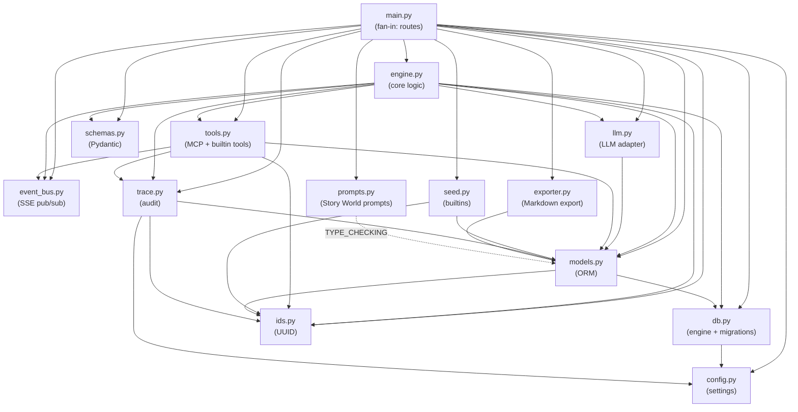
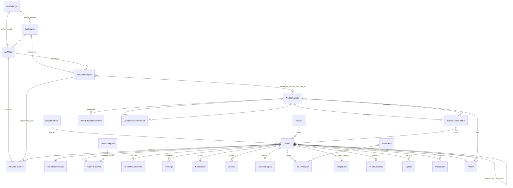
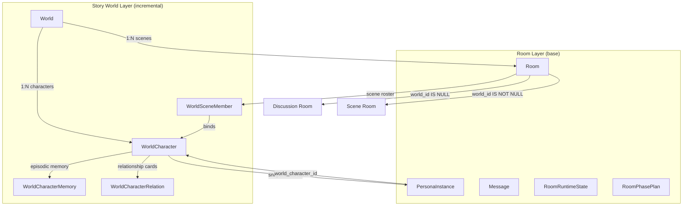
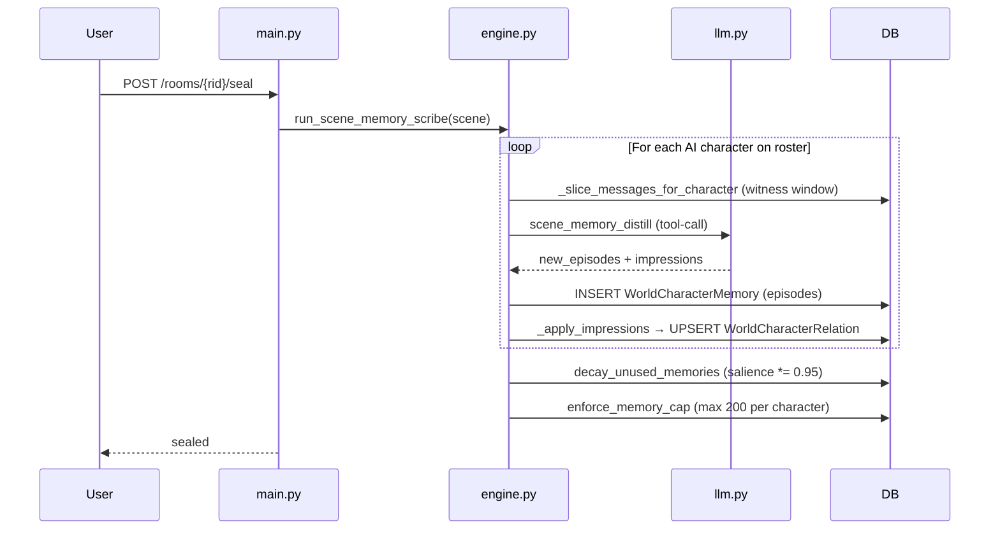

# MAI Architecture Map

> Generated: 2026-05-12 | Scope: global read-only audit | No code changes.

---

## 1. Architecture Overview

MAI is a single-process, local-first application: **FastAPI + SQLAlchemy async** backend (`backend/app`) with a **Vite + React + TypeScript** frontend (`frontend/src`). SQLite is the default store; PostgreSQL is optional via `DATABASE_URL`. The desktop shell uses Tauri v2 with a PyInstaller sidecar.

```
┌─────────────────────────────────────────────────────────────┐
│  Frontend (Vite + React 18 + TypeScript)                    │
│  ├── Zustand (streaming / theme)                            │
│  ├── TanStack Query (server state)                          │
│  ├── SSE via useRoomEvents                                  │
│  └── ~70 typed fetch calls → api.ts                         │
├──────────── HTTP + SSE ─────────────────────────────────────┤
│  Backend (FastAPI + SQLAlchemy async + LiteLLM)             │
│  ├── main.py    — all routes, SSE, SPA mount                │
│  ├── engine.py  — scheduling, streaming, scribe, freeze     │
│  ├── llm.py     — LiteLLM wrapper, peer routing             │
│  ├── tools.py   — builtin + MCP tool layer                  │
│  ├── models.py  — 27 SQLAlchemy tables                      │
│  ├── schemas.py — ~90 Pydantic models                       │
│  └── db.py      — engine, migrations, _ADDED_COLUMNS        │
├──────────── Storage ────────────────────────────────────────┤
│  SQLite (default) / PostgreSQL (optional)                   │
│  uploads/          — file attachments                       │
│  trace_payloads/   — large trace sidecar JSON               │
└─────────────────────────────────────────────────────────────┘
```

---

## 2. Backend Module Map

### 2.1 Module Responsibilities

| Module | Layer | Responsibility |
|--------|-------|---------------|
| `main.py` | Route | All HTTP routes, SSE endpoint, middleware, SPA mount, lifespan bootstrap |
| `engine.py` | Core | Autodrive scheduling, speaker selection, LLM streaming orchestration, scribe/facilitator dispatch, phase lifecycle, freeze/pause, memory scribe |
| `llm.py` | Core | LiteLLM `acompletion` wrapper; streaming, tool-calling, structured-tool-completion; model resolution; peer-name message routing; system prompt assembly |
| `models.py` | Data | 27 SQLAlchemy ORM table classes |
| `schemas.py` | Data | ~90 Pydantic request/response models, discriminated unions for phase rules |
| `db.py` | Infra | Async engine creation, session factory, `create_all` + `_ADDED_COLUMNS` self-healing, migration orchestrator |
| `config.py` | Infra | `pydantic-settings` config: DB URL, CORS, data dirs, trace thresholds |
| `tools.py` | Core | Builtin tools (4), MCP server sync/call, tool-schema aggregation, `ToolInvocation` persistence |
| `event_bus.py` | Infra | In-process `asyncio.Queue` pub/sub keyed by `room_id` for SSE |
| `prompts.py` | Core | Story World prompt composition: memories, relations, scene-persona system prompt |
| `seed.py` | Data | Built-in data definitions (4 providers, 25 personas, 13 phases, 7 formats, 2 recipes) |
| `ids.py` | Infra | `uuid7()` for new IDs, `uuid5()` for deterministic builtin IDs |
| `trace.py` | Infra | Trace event recording to DB + optional JSON sidecar on disk |
| `exporter.py` | Util | Room transcript export to Markdown |
| `init_db.py` | CLI | Entry point: `create_schema()` + `seed_builtins()` |

### 2.2 Migration Layer

| Module | Type | Purpose |
|--------|------|---------|
| `migrate_personas.py` | One-shot | Legacy `personas` → `persona_templates` + `persona_instances` split |
| `migrate_settings.py` | One-shot | Blank `backing_model` on builtins to fall through to `AppSettings` |
| `migrate_api_models.py` | One-shot | Create `api_models` from legacy `(provider_id, backing_model)` pairs |
| `migrate_drop_vendor.py` | One-shot | Drop legacy `api_providers.vendor` column |
| `migrate_seed_story_mode.py` | One-shot | Backfill `story_mode` phase + `story_format` on existing DBs |
| `migrate_story_mode_v2.py` | One-shot | Tighten story-mode role_constraints |
| `migrate_persona_identity.py` | One-shot | Backfill `identity` column (name vs role label split) |
| `migrate_seed_new_personas.py` | One-shot | Insert 13 new built-in persona templates |
| `migrate_builtin_personas_update.py` | Standing | Runs every startup; syncs builtin persona fields from `seed.py` |

### 2.3 Import Graph (intra-package)



---

## 3. Frontend Module Map

### 3.1 Layer Architecture

```
main.tsx
  QueryClientProvider (staleTime: 5s)
    BrowserRouter
      I18nProvider (zh-CN / en-US, ~730 keys each)
        ConfirmProvider (Radix UI)
          App
            AppRail                ← left nav rail
            UpdateBanner           ← Tauri auto-update
            DesktopDiagnostics     ← Tauri sidecar crash
            SetupBanner            ← first-run wizard
            <Routes>
```

### 3.2 Routes

| Path | Component | Layout |
|------|-----------|--------|
| `/` | `HomePage` | Standard (centered, max-w-1500px) |
| `/dashboard` | `DashboardPage` | Standard |
| `/dashboard/new` | `NewDiscussionPage` | Standard |
| `/templates/:kind` | `TemplatesPage` | Standard |
| `/settings` | `SettingsPage` | Standard |
| `/tools` | `ToolsPage` | Standard |
| `/worlds` | `WorldListPage` | Standard |
| `/worlds/:worldId` | `WorldDetailPage` | Standard |
| `/rooms/:roomId` | `RoomShell` | Full-height (no container) |
| `/rooms/:roomId/sub/:subId` | `RoomShell` | Full-height |

### 3.3 State Management

| Layer | Scope | Mechanism |
|-------|-------|-----------|
| `useUIStore` (Zustand) | Theme, SSE streaming buffer, connection status | `zustand/persist` (localStorage for `dark` + `showApiErrorDetail`) |
| TanStack Query | All server data | `useQuery` / `useMutation`; keys in `queryKeys.ts` factory |
| SSE (`useRoomEvents`) | Real-time room updates | EventSource → `queryClient.invalidateQueries` with 250ms debounce |
| Local `useState` | Component-scoped UI state | Per-component |

### 3.4 Page → Component Hierarchy

```
RoomShell (3-column)
  ├── RoomListSidebar          (left: room cards + search)
  ├── MessageList              (center: react-virtuoso)
  │     └── MarkdownBlock, MentionChip, PersonaIcon, StatusPill
  ├── Composer                 (bottom: modes normal/judge/dead_end/masquerade/narration/act_as)
  ├── SpeakerStateBar          (above messages: 4-state indicator)
  ├── PhaseExitBanner          (conditional)
  ├── MembersSidebar           (right: persona instances)
  ├── RightPanel               (tabbed)
  │     ├── PhasePlanPanel
  │     ├── ScribePanel
  │     ├── FacilitatorPanel
  │     ├── DecisionsPanel
  │     ├── ToolPanel
  │     ├── LimitPanel
  │     ├── UploadPanel
  │     └── SubroomPanel
  └── RoomSettingsDrawer

TemplatesLayout (5 tabs)
  ├── PersonasTab              (CRUD + AI draft)
  ├── PhasesTab                (CRUD)
  ├── FormatsTab               (CRUD + dnd-kit drag reorder)
  ├── RecipesTab               (CRUD)
  └── ProvidersTab             (API provider + model CRUD)

WorldDetailPage (2-column)
  ├── Character list           (add/edit/retire/batch-add)
  └── Scene timeline           (create/inspect sealed scenes)
```

### 3.5 Shared Components

| Component | Usage |
|-----------|-------|
| `AppRail` | Global left nav on all non-room pages |
| `SectionCard` | Reusable card with tone-colored left border |
| `StatusPill` | Small colored badge (neutral/brand/info/success/warning/danger) |
| `PersonaIcon` | Icon renderer mapping ~40 lucide names + color |
| `PersonaTemplatePicker` | Searchable multi-select modal for persona templates |
| `PhaseStepper` | Horizontal phase progression indicator |
| `MarkdownBlock` | react-markdown + remark-gfm + KaTeX + Shiki |
| `MentionChip` | Inline `@name` badge |
| `ConfirmDialog` | Radix UI destructive-action confirmation |
| `Toaster` | Sonner toast wrapper |

---

## 4. Data Model Map

### 4.1 Entity-Relationship Diagram



### 4.2 Table Classification

| Category | Tables | Role |
|----------|--------|------|
| **Core Config** | `app_settings`, `api_providers`, `api_models` | Global LLM provider/model configuration |
| **Template System** | `persona_templates`, `phase_templates`, `debate_formats`, `recipes` | Reusable templates (built-in + user) |
| **Room Runtime** | `rooms`, `room_runtime_state`, `room_phase_plan`, `room_phase_instances`, `persona_instances` | Per-room runtime state |
| **Messages & Output** | `messages`, `decisions`, `scribe_states`, `facilitator_signals`, `merge_backs`, `room_snapshots`, `uploads` | Discussion artifacts |
| **Tools & Audit** | `tool_servers`, `tool_invocations`, `trace_events` | MCP tools and audit trail |
| **Story World** | `worlds`, `world_characters`, `world_scene_members`, `world_character_memories`, `world_character_relations` | Cross-room narrative layer |
| **Legacy** | `personas`, `room_personas` | Superseded by template/instance split; kept for migration |
| **Infra** | `users`, `_migrations` | Auth (unused) and migration tracking |

### 4.3 Schema Migration Strategy

No Alembic. Two mechanisms:

1. **`Base.metadata.create_all`** — creates new tables on fresh DBs.
2. **`db.py::_ADDED_COLUMNS`** — self-healing `ALTER TABLE ADD COLUMN` for existing tables (dialect-specific DDL for SQLite and PostgreSQL).
3. **One-shot data migrations** — tracked in `_migrations` table; each runs once.
4. **Standing migration** — `migrate_builtin_personas_update` runs every startup to sync builtin persona content.

---

## 5. API Contract Map

### 5.1 Route Group Summary

| Group | Routes | Prefix |
|-------|--------|--------|
| Health & Settings | 3 | `/health`, `/settings` |
| Tools & MCP | 7 | `/tools/*`, `/rooms/{id}/tools/*` |
| AI Assistants | 2 | `/scenarios`, `/assistants/*` |
| Persona Templates | 5 | `/templates/personas/*` |
| API Providers | 6 | `/templates/api-providers/*` |
| API Models | 5 | `/templates/api-models/*` |
| Phase Templates | 7 | `/templates/phases/*` |
| Debate Formats | 5 | `/templates/formats/*` |
| Recipes | 6 | `/templates/recipes/*` |
| Rooms | 18 | `/rooms/*` (CRUD + lifecycle) |
| Room Messages | 8 | `/rooms/{id}/messages/*`, `/verdicts`, `/masquerade`, `/turn` |
| Room Phases | 5 | `/rooms/{id}/phase/*` |
| Room Limits & Sub | 3 | `/rooms/{id}/limits`, `/subrooms`, `/merge_back` |
| Upload | 1 | `/upload` |
| Story World CRUD | 10 | `/worlds/*` |
| World Characters | 4 | `/worlds/{id}/characters/*` |
| Character Memory | 4 | `/worlds/{id}/characters/{id}/memories/*` |
| Character Relations | 4 | `/worlds/{id}/characters/{id}/relations/*` |
| Scenes | 6 | `/worlds/{id}/scenes`, `/rooms/{id}/scene/*`, `/rooms/{id}/seal` |
| **Total** | **~108** | |

### 5.2 Frontend ↔ Backend Contract Sync Points

When adding a new API endpoint, these files must stay in sync:

| Layer | File |
|-------|------|
| Backend route | `backend/app/main.py` |
| Backend schema | `backend/app/schemas.py` |
| Frontend types | `frontend/src/types.ts` |
| Frontend API | `frontend/src/api.ts` |
| React Query keys | `frontend/src/queryKeys.ts` |
| SSE events | `backend/app/event_bus.py` + `frontend/src/hooks.ts` |

---

## 6. Story World ↔ Discussion Room Relationship

### 6.1 Architectural Relationship



### 6.2 Behavioral Differences

| Behavior | Discussion Room (`world_id IS NULL`) | Scene Room (`world_id IS NOT NULL`) |
|----------|--------------------------------------|--------------------------------------|
| **Speaker selection** | All `PersonaInstance` members | Only active `WorldSceneMember` roster (exited filtered out) |
| **Room-level scribe** | Runs every 5 messages; tracks consensus/disagreements | **Bypassed** (`run_scribe_update` short-circuits) |
| **Facilitator** | Runs every 5 messages + phase boundaries | **Bypassed** (unless `force=True`) |
| **Memory pipeline** | None | Per-character episodic scribe at seal time |
| **Phase format** | User-selected | Defaults to `story_format` (single phase, never auto-exits) |
| **Composer modes** | normal / judge / dead_end / masquerade | narration / act_as |
| **Message routing** | Standard peer routing | Same, plus `as_character_id` for user-as-character |
| **Seal lifecycle** | N/A | `POST /rooms/{id}/seal` → memory distillation + decay + cap enforcement |
| **Scribe output** | `ScribeState` (consensus, decisions) | `WorldCharacterMemory` + `WorldCharacterRelation` |
| **Room list** | Shows in discussion sidebar | Filtered out of discussion sidebar; shown in World timeline |

### 6.3 Memory Pipeline at Seal



---

## 7. Module Layer Classification

### 7.1 Core Main Path

These modules are on the critical path for every discussion room interaction:

| Module | Why Core |
|--------|----------|
| `main.py` | All routes pass through here |
| `engine.py` | Speaker selection, autodrive, streaming, phase lifecycle, scribe/facilitator |
| `llm.py` | Every AI turn calls LiteLLM through this adapter |
| `models.py` | Every DB operation touches these ORM classes |
| `schemas.py` | Every request/response is validated here |
| `db.py` | Session factory and schema management |
| `event_bus.py` | All real-time SSE events flow through here |

### 7.2 Core Feature Path

These modules implement major product features:

| Module | Feature |
|--------|---------|
| `tools.py` | MCP tool integration, tool invocation |
| `prompts.py` | Story World prompt composition |
| `seed.py` | Built-in persona/phase/format/recipe data |
| `config.py` | Application configuration |

### 7.3 Infra / Utility Layer

| Module | Role |
|--------|------|
| `ids.py` | UUID generation (standalone, no dependencies) |
| `trace.py` | Audit trail recording |
| `exporter.py` | Markdown export utility |
| `init_db.py` | CLI bootstrap entry point |

### 7.4 Migration Layer

| Module | Status | Notes |
|--------|--------|-------|
| `migrate_personas.py` | One-shot | Legacy split; most active DBs already migrated |
| `migrate_settings.py` | One-shot | Legacy model resolution cleanup |
| `migrate_api_models.py` | One-shot | Legacy provider/model migration |
| `migrate_drop_vendor.py` | One-shot | Column removal |
| `migrate_seed_story_mode.py` | One-shot | Backfill story mode phase/format |
| `migrate_story_mode_v2.py` | One-shot | Story mode prompt tightening |
| `migrate_persona_identity.py` | One-shot | Identity column backfill |
| `migrate_seed_new_personas.py` | One-shot | 13 new built-in personas |
| `migrate_builtin_personas_update.py` | Standing | Runs every startup; syncs builtin content |

### 7.5 Legacy / Compat Layer

| Artifact | Status | Notes |
|----------|--------|-------|
| `Persona` model (`personas` table) | Legacy | Superseded by `PersonaTemplate` + `PersonaInstance`; kept for migration |
| `RoomPersona` model (`room_personas` table) | Legacy | Superseded by `PersonaInstance.room_id` FK |
| `backing_model` / `api_provider_id` on templates | Compat fallback | New writes use `api_model_id`; legacy fields only read for old data |
| `PersonaCreate` / `PersonaUpdate` / `PersonaOut` schemas | Legacy | Not used by current routes |
| `AddPersonasRequest` schema | Legacy | Replaced by `AddPersonaInstancesRequest` |

### 7.6 Frontend Layer Classification

| Layer | Files | Role |
|-------|-------|------|
| **Core Shell** | `App.tsx`, `AppRail.tsx`, `main.tsx` | App skeleton, routing, providers |
| **Room (core)** | `RoomShell.tsx`, `MessageList.tsx`, `Composer.tsx`, `SpeakerStateBar.tsx` | Primary discussion interface |
| **Room (panels)** | `RightPanel.tsx`, 8 panel components | Side-drawer feature panels |
| **Templates** | `TemplatesLayout.tsx`, 5 tab components, 3 shared | Template CRUD |
| **Story World** | `WorldListPage.tsx`, `WorldDetailPage.tsx`, `SceneInspectorDialog.tsx` | World/character/scene management |
| **Dashboard** | `HomePage.tsx`, `DashboardPage.tsx`, `NewDiscussionPage.tsx` | Room creation and overview |
| **Config** | `SettingsPage.tsx`, `ToolsPage.tsx` | App settings and MCP management |
| **Shared** | 10 shared components, 5 utils | Reusable UI primitives |
| **State** | `store.ts`, `queryKeys.ts`, `hooks.ts`, `api.ts` | State management and data fetching |
| **i18n** | `i18n.tsx` | ~730 translation keys, display labels |
| **Desktop** | `desktopDiagnostics.ts`, `UpdateBanner`, `DesktopDiagnosticsBanner` | Tauri-specific |

---

## 8. High-Risk Area Candidates

> This is a candidate list for future review, not an analysis. No deep-dive performed in this pass.

| Area | Why Flagged | Location |
|------|-------------|----------|
| **engine.py size** | ~1800 lines; handles scheduling, streaming, scribe, facilitator, memory, freeze — high coupling | `backend/app/engine.py` |
| **main.py size** | ~3000+ lines; all routes in one file; route ordering matters (SPA mount at bottom) | `backend/app/main.py` |
| **_ADDED_COLUMNS growth** | 33 entries and growing; dialect-specific DDL maintenance burden | `backend/app/db.py` |
| **Legacy table accumulation** | `personas` + `room_personas` tables still present; migration debt | `backend/app/models.py` |
| **SSE single-process constraint** | `event_bus.py` is in-memory asyncio; blocks horizontal scaling | `backend/app/event_bus.py` |
| **LiteLLM tool_choice fallback** | Three-tier degradation (forced → auto → no-tools JSON) is complex; provider-specific quirks | `backend/app/llm.py` |
| **Frontend api.ts size** | ~70 methods in a single object; no domain grouping | `frontend/src/api.ts` |
| **i18n inline dictionaries** | ~730 keys × 2 languages inline in one file; no extraction tooling | `frontend/src/i18n.tsx` |
| **Story World prompt assembly** | Prompt composition spans `engine.py`, `main.py`, `prompts.py` — logic scattered across 3 files | `backend/app/{engine,main,prompts}.py` |
| **Migration chain ordering** | 9 sequential migrations with implicit dependencies; no rollback mechanism | `backend/app/db.py` + `migrate_*.py` |
| **PersonaTemplate/Instance field drift** | Both carry `color`, `icon`, `identity`, `talkativeness`, `api_model_id` — sync risk on template updates | `backend/app/models.py` |
| **Room state multi-source** | `RoomRuntimeState` + `Room.status` + `frozen_at` + `sealed_at` — runtime state scattered across multiple signals | `backend/app/models.py` |
